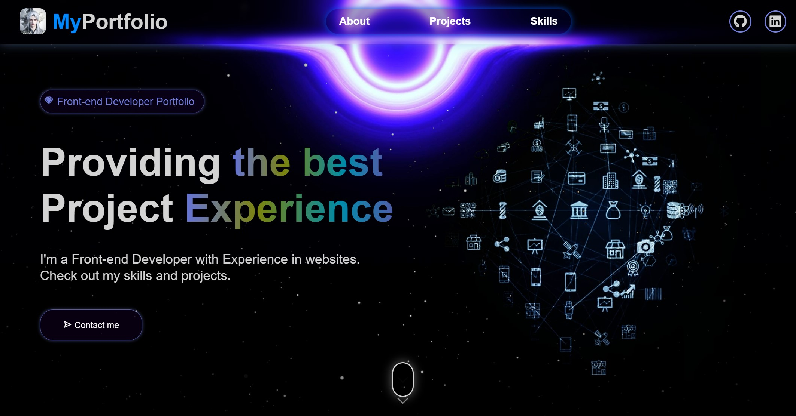

# 💼 Personal Portfolio Website — Smallqode

A responsive and animated portfolio website built using HTML, CSS, and JavaScript to showcase my development projects, skills and contact information in an engaging and interactive way.



---

## 🚀 Features

- 🎬 **Video Backgrounds**: Immersive visuals with `mix-blend-mode` effects.
- 🧩 **Project Cards**: Showcasing real projects with embedded video previews and external links.
- 📱 **Fully Responsive Design**: Optimized for desktop, tablet, and mobile devices.
- 💡 **Animated UI**: Smooth entrance animations using scroll-based triggers (`animation-timeline: view()`).
- 🌈 **Modern UI**: Gradient text, hover effects, and clean layout.
- 🖼️ **Skills Carousel**: Display of tech stack with icons.
- 🔗 **Contact Section**: Placeholder form with fields for Name, Email, and Message.
- 🧠 **Interactive Sidebar**: Toggleable navigation menu for smaller screens.

---

## 🛠️ Built With

- **HTML5** – Semantic layout structure
- **CSS3** – Styling, animations, transitions, and responsiveness
- **JavaScript (Vanilla)** – Sidebar toggling and interaction
- **Boxicons / Font Awesome** – Iconography
- **Responsive Design** – Mobile-first with media queries

---

## 📁 Project Structure

```
portfolio/
├── index.html
├── style.css
├── app.js
├── Images/
│   ├── WangLin.jpeg
│   ├── react-Logo.png
│   └── (skills icons)
├── Videos/
│   ├── galaxy.mp4
│   ├── blackhole.mp4
│   ├── hero-video.mp4
│   └── project1.mp4, project2.mp4, project3.mp4
```

---

## 📸 Screenshots

> `Images/` 

---

## ⚙️ Getting Started

To run the portfolio locally:

1. **Clone the repository**
   ```bash
   git clone https://github.com/your-username/portfolio.git
   ```

2. **Navigate to the folder**
   ```bash
   cd portfolio
   ```

3. **Open `index.html` in any browser**

---

## 🎯 How to Customize

- ✏️ Replace text and update image/video assets in the `Images/` and `Videos/` folders.
- 🔗 Update social links and project links in `index.html`.
- ✉️ Connect the contact form to Formspree, EmailJS, or your backend.
- 🎥 Replace `hero-video.mp4` and `projectX.mp4` with your own videos.

---

## 📬 Contact

Made with ❤️ by **Smallqode**

- 🌐 Portfolio: [Live Website](#) <!-- Replace with actual link -->
- 📧 Email: your.email@example.com
- 🐙 GitHub: [github.com/smallqode](https://github.com/smallqode)
- 💼 LinkedIn: [linkedin.com/in/yourprofile](https://linkedin.com/in/yourprofile)

---

## 🪪 License

This project is open source and free to use for personal or educational purposes.

---

## 🏁 Credits

- Background videos: [Pexels](https://pexels.com), [Coverr](https://coverr.co), or custom-made
- Icons: [Boxicons](https://boxicons.com), [Font Awesome](https://fontawesome.com)
